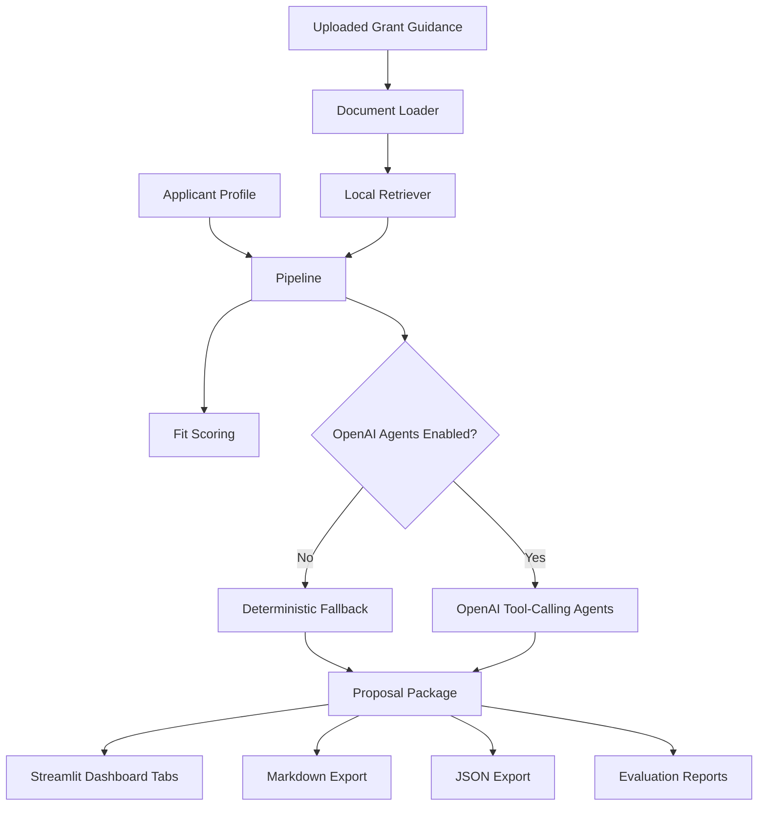
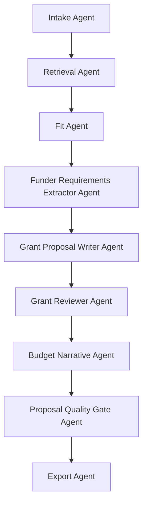
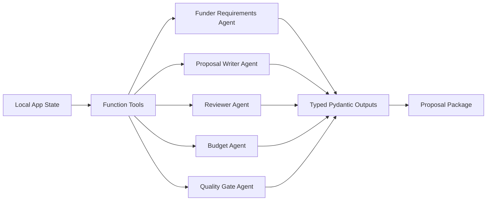
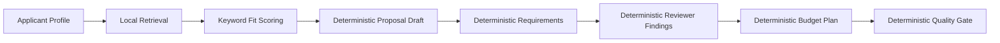

# Architecture

## System Overview

Agentic Grant Proposal Builder is a Streamlit-first Agentic RAG application. It converts applicant profile data and grant guidance into a structured proposal package with evidence retrieval, funder-fit scoring, extracted funder requirements, proposal drafting, reviewer findings, budget planning, quality-gate review, and benchmark evaluation.

## Agent Workflow

## OpenAI Runtime Path

When `OPENAI_API_KEY` exists and `AGPB_USE_OPENAI_AGENTS=1`, the OpenAI-powered path activates. The application still performs local retrieval and funder-fit scoring before agent execution.

## Deterministic Fallback Path

The app remains useful without an API key.

## Data Flow

1. Applicant profile fields are normalized into `OrganizationProfile`.
2. Uploaded text, Markdown, or PDF files are normalized into `GrantDocument`.
3. Source text is chunked and searched through local TF-IDF retrieval.
4. Retrieved evidence drives funder-fit scoring.
5. Agentic or deterministic proposal package generation runs.
6. The dashboard displays proposal, requirements, evidence, reviewer findings, quality gate, and exports.
7. The evaluation harness runs synthetic scenarios and writes JSON and Markdown reports.

## Safety And Review Boundaries

The system supports proposal drafting and review. It does not guarantee eligibility, legal compliance, funding likelihood, or funder acceptance. Human review remains required before submission.
